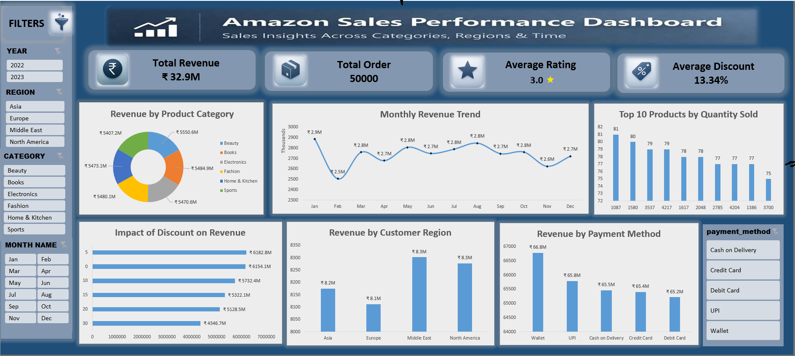

# 📊 Amazon Sales Performance Dashboard

## 🔎 Project Overview
This project analyzes Amazon sales data to uncover insights related to revenue trends, product performance, and customer behavior using an interactive Excel dashboard.

---

## 📁 Dataset
- Total Orders: 50,000  
- Total Revenue: ₹32.9M  
- Average Rating: 3.0  
- Average Discount: 13.34%  

---

## 🛠 Tools Used
- SQL (Data Cleaning & Analysis)  
- Excel (Pivot Tables, Dashboard Design)  

---

## 📊 Dashboard

---

## 📈 Key Insights
- Revenue shows fluctuation across months with peak performance in specific periods  
- Certain product categories contribute more to overall revenue  
- Discounts do not always lead to higher revenue  
- Wallet and digital payments dominate transactions  

---

## 💡 Recommendations
- Optimize discount strategies based on category performance  
- Focus on high-performing regions and products  
- Improve pricing strategy for underperforming categories  
- Encourage digital payment methods for better transaction flow  

---

## 🚀 Project Outcome
This project demonstrates the ability to analyze business data, build interactive dashboards, and generate actionable insights.

---

## 🔗 Connect with Me
LinkedIn: https://www.linkedin.com/in/gnana-sekar-g-694b702a3/
